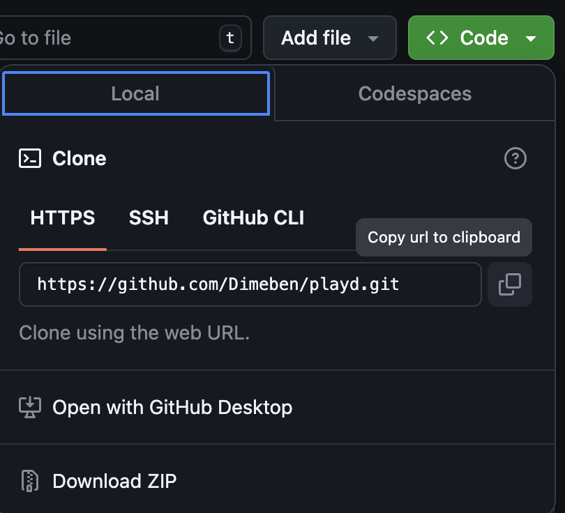

# Welcome to Playd! 🎵🎉

[Watch the App Walkthrough](https://www.youtube.com/watch?v=2VABk7nJpeA)

## Tech Stack

- **JavaScript**
- **TypeScript**
- **React Native**
- **Expo**
- **Firebase**

---

## 🚀 Getting Started

### 📥 Clone the Repository

1. Click the green **Code** button and copy the repository URL.

   

2. Open your terminal and navigate to the directory where you want to download the project:

   ```bash
   cd Downloads
   ```

3. Clone the repository:

   ```bash
   git clone https://github.com/Dimeben/playd.git
   ```

4. Navigate to the project folder:

   ```bash
   cd playd
   ```

5. Open the project in your editor:

   ```bash
   code .
   ```

---

### 🛠 Installation & Running the App

1. Install dependencies:

   ```bash
   npm install
   ```

2. Start the app using Expo:

   ```bash
   npx expo start
   ```

   In the output, you'll find options to open the app in:

   - A [development build](https://docs.expo.dev/develop/development-builds/introduction/)
   - An [Android emulator](https://docs.expo.dev/workflow/android-studio-emulator/)
   - An [iOS simulator](https://docs.expo.dev/workflow/ios-simulator/)
   - [Expo Go](https://expo.dev/go), a limited sandbox for app development with Expo

---

## 🌟 Features

### For Users

1. **Login/Sign-up**  
   Create an account or log in to access the app's features.

2. **Browse DJs**  
   View a list of available DJs filtered by location, genre, and occasion.

3. **DJ Profile**  
   Explore individual DJ profiles with pricing, ratings, and other details.

4. **Book a DJ**  
   Easily book DJs directly from their profile.

5. **Manage Bookings**  
   Track and manage past and upcoming bookings.

6. **Leave Feedback**  
   Provide feedback for DJs after events.

7. **Profile Management**  
   Update your personal profile details anytime.

---

### For DJs

1. **Login/Sign-up**  
   Create a profile to start offering your services.

2. **View Your Profile**  
   Preview your profile as seen by potential clients.

3. **Edit Profile**  
   Update profile details like description, pricing, genres, and more.

4. **Manage Bookings**  
   View, confirm, or reject incoming booking requests.

5. **View Other DJs**  
   Browse other DJs to network or check out the competition.

6. **Feedback Review**  
   Respond to client feedback after gigs.
